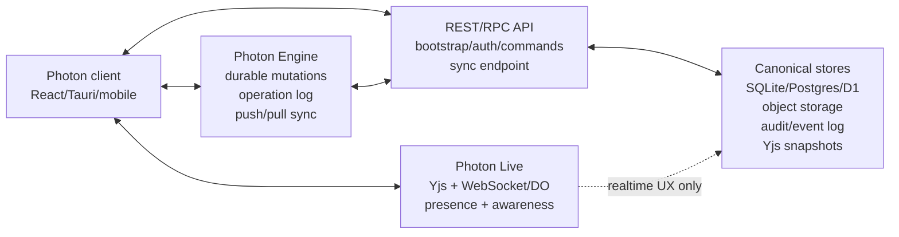

# ADR-0001: Sync Responsibility Boundaries

## Status

Superseded by [ADR-0002](ADR-0002-photon-engine-as-the-product.md) (2026-07-25). Originally accepted 2026-05-08.

Engine と Live の責務分割自体はいまも有効で、そのまま効いている。ADR-0002 が変えたのは 2 点だけ:

1. 構造化データが Yjs に二重書きされなくなり、operation log が単一権威になった
2. 「アプリサーバが domain data を所有する」書き込みパス（下記の手順 1–6）が operation log に置き換わった

follow-up の PLT-1180 / 1183 / 1186 / 1188 は「実装により解決」ではなく「削除により解決」となった。

## Context

Photon は React/Vite/Tauri frontend、Yjs local-first state、Cloudflare Workers + Durable Objects sync relay、Rust axum + SQLite backend を持っている。

現状の frontend は `src/lib/yjs/yjsProvider.ts` で単一の `Y.Doc` を作り、`y-indexeddb` で `workspace:{workspaceId}:records` に保存し、`/ws` に Yjs binary update を送っている。`src/contexts/RecordsContext.tsx` の record CRUD は application server の accepted response を Yjs projection に反映する。

Cloudflare sync backend の Durable Object 実装は opaque な Yjs update を保存、replay、broadcast する。presence は WebSocket connection 数から計算する。この backend は update payload を domain data として解釈しない。現在は user-session 検証が未接続なため、Worker と Durable Object の public `/ws` entry point は HTTP 403 で fail-closed している。

Rust server は `crates/photon-axum/src/lib.rs` で record API、SQLite storage、yrs-based `/ws` sync endpoint を提供する。structured domain data は Photon Engine の `scope + collection + record_id` model に寄せ、surface 固有の互換 layer を増やさない。

Photon Workspace v0.2 では records だけでなく、Notion-like editor documents、attachments、chat messages、tool calls、workspace metadata も扱う。これらは realtime collaboration だけでなく、server-side persistence、permissions、audit、search、migration に乗る必要がある。

## Decision

Cloudflare Worker + Durable Object sync は frontend Yjs document の realtime consistency relay として扱う。canonical application server そのものにはしない。この realtime collaborative UX path を **Photon Live** と呼ぶ。

Durable mutation / offline sync / projection / conflict / replay の path を **Photon Engine** と呼ぶ。Photon Engine は durable truth を守り、Photon Live は shared experience を作る。

Photon の責務境界は次のように分ける。

| Surface | Canonical owner | Relay/cache role |
| --- | --- | --- |
| Workspace, project, user, permissions | Application server | Client cache only |
| Records | Application server domain store | Yjs projection and optimistic local cache |
| Editor documents | Application server owned Yjs snapshot/update log, with optional block projection | Realtime Yjs room relay and local IndexedDB cache |
| Attachments | Object storage plus server metadata | Yjs references and preview cache |
| Chat messages, tool calls, tool results | Application server | Streaming UI cache; optional local draft cache |
| Presence, online count, cursors | Sync relay | Ephemeral only |
| Theme and personal UI preferences | Local client storage unless explicitly shared | No server authority by default |

The target architecture has three layers:

Photon Live can keep the UI responsive offline by using local Yjs/IndexedDB state, but its network responsibilities are opportunistic: presence, awareness, and broadcast pause while disconnected. Photon Engine keeps durable local mutations and reconciles them when the sync endpoint is reachable again.

### Production Server Roles

Production deployment treats Engine and Live as separate roles.

- `photon-engine-server` owns durable operation sync and exposes `/api/engine/push` and `/api/engine/pull`.
- `photon-live-server` owns realtime collaboration and exposes `/ws`.
- `photon-server` may run both roles together for local compatibility, but it is not the preferred production topology.

Photon Engine storage must be durable database storage. TiDB/MySQL is supported via `PHOTON_ENGINE_DATABASE_URL=mysql://...`; SQLite remains acceptable for local development and preview data only. Photon Live may share Engine storage for Yjs snapshot/update persistence, but its API surface remains realtime-only.

The client-side Engine runtime stores pending operations in PGlite. When the Engine server is reachable, the client pushes those pending operations to `/api/engine/push`; accepted decisions mark local operations as accepted. Pull sync uses `/api/engine/pull` with a cursor to receive accepted operations from other clients.

### Write Path

Domain writes must eventually be accepted by the application server.

For record CRUD and other structured domain data, the target write path is:

1. Client applies an optimistic local mutation to Yjs/IndexedDB for instant UI.
2. Client sends a domain mutation to the application server.
3. Application server validates permissions, ids, status transitions, schema, and audit metadata.
4. Application server persists the canonical change and returns the accepted version.
5. Client reconciles local Yjs state with the accepted server version.
6. Sync relay broadcasts Yjs updates to other connected clients for realtime consistency.

During migration, Photon may temporarily materialize server projections from existing Yjs updates. That bridge is allowed only to remove current split-brain behavior; the long-term authority for structured domain data remains the application server.

For editor document content, Yjs can remain the collaboration data model, but the canonical copy must be stored and compacted by the application server or an application-owned storage path. Durable Object replay logs are not enough for long-term document truth.

### Read Path

Cold start and reconnect should follow this order:

1. Client authenticates with the application server.
2. Client loads workspace metadata, authorized document/record rooms, and latest server snapshots or projections.
3. Client hydrates local Yjs/IndexedDB state from the accepted server version when needed.
4. Client connects to the sync relay for realtime updates.
5. Client reconciles remote Yjs updates with domain projections exposed by the application server.

Record list/table/kanban screens may continue to render from Yjs for low-latency updates, but the app must be able to explain the same data from server-owned projections.

### Room And Authorization Model

Room ids are server-issued or server-derived. Clients should not invent durable room ids without server context.

The sync relay may verify a room token or signed room claim before accepting a WebSocket connection. That check only protects the realtime channel. Domain authorization, audit, and validation stay with the application server.

Room naming should reserve space for future surfaces:

- `workspace:{workspaceId}:records`
- `workspace:{workspaceId}:doc:{docId}`
- `workspace:{workspaceId}:chat:{threadId}`

The exact encoding can change, but room ids must include workspace scope and surface scope.

## Consequences

### Positive

- Cloudflare Worker sync can stay small, fast, and replaceable.
- Frontend collaboration can remain local-first and responsive.
- The application server can own permissions, validation, audit, search, migrations, and integration APIs.
- Records, documents, attachments, and chat/tool history can converge on one server data model instead of separate client-only islands.
- Future hosting choices are easier because relay transport and canonical data storage are separate decisions.

### Negative

- Some writes require both optimistic Yjs updates and server reconciliation.
- Structured record data needs server reconciliation coverage so Yjs projection and canonical storage stay aligned.
- Editor content needs a real snapshot/compaction strategy beyond Durable Object bounded replay.
- Tests must cover both realtime client convergence and server canonical persistence.

### Neutral

- This ADR does not require replacing Yjs.
- This ADR does not require choosing the final production database.
- This ADR does not decide whether Rust, Tachyon Agent API, D1, or another service hosts the final application server.
- The Cloudflare relay can still be used in production as the realtime transport.

## Alternatives Considered

### Make Durable Object the canonical application server

Rejected. Durable Objects are a good room-local coordination primitive, but Photon needs domain validation, cross-room queries, audit, permissions, attachments, search, migrations, and integration APIs. Putting all of that behind opaque Yjs update replay would make server data harder to inspect and evolve.

### Make REST/SQLite the only source and remove Yjs local-first writes

Rejected. Photon's product direction depends on responsive local-first editing, realtime collaboration, and offline-friendly behavior. Removing Yjs would make the frontend simpler but would weaken the workspace experience.

### Keep frontend Yjs and Rust REST/SQLite as independent systems

Rejected. This is the current split-brain risk. It is acceptable only as an intermediate state while PoC features are being built.

### Persist only Yjs update logs forever

Rejected. Infinite replay gets slower over time and makes repair, migration, search, and server-side querying difficult. Long-lived content needs compaction into snapshots and, for domain entities, materialized projections.

## Follow-up

- PLT-1180: Resolve record split-brain between frontend Yjs and Rust REST/SQLite.
- PLT-1181: Add workspace/document room model and route room ids through config.
- PLT-1182: Implement Yjs snapshot compaction and replay strategy. ✅ Done — DO + server compact at threshold, hydrate via snapshot + log replay; corrupt rows are skipped with a warning.
- PLT-1183: Build chat tools on top of the canonical record write/read path.
- PLT-1186: Add Notion-like editor with server-owned document snapshots.
- PLT-1188: Move attachment metadata/storage into server-syncable domain data.
- PLT-1189: Add E2E/CI coverage for sync, persistence, chat tools, editor, and attachments.

## References

- `src/lib/yjs/yjsProvider.ts`
- `src/lib/yjs/useYjsRecords.ts`
- `src/contexts/RecordsContext.tsx`
- `packages/edge-worker/src/index.ts`
- `crates/photon-axum/src/lib.rs`
- `crates/photon-engine/src/sqlite.rs`
- `docs/cloudflare-sync.md`
