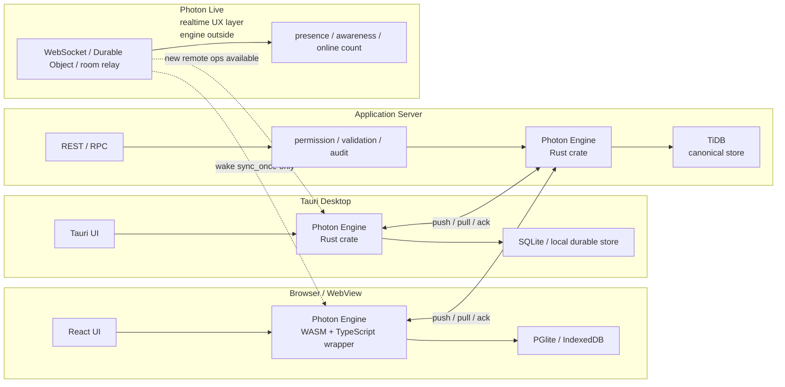
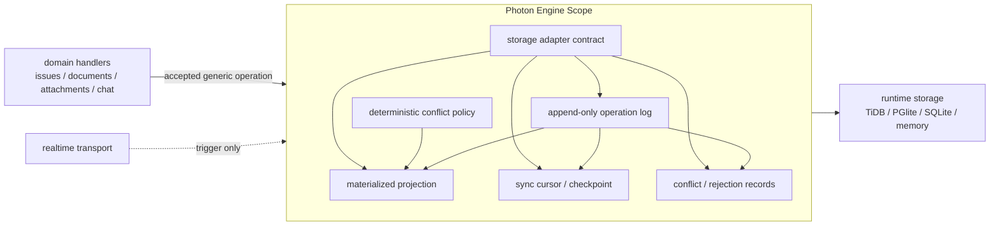

# Photon Engine: Universal Offline Sync Core

## 概要

Photon Engine は、Photon と Tachyon 全体で使える local-first durable sync core として設計する。
Rust core を中心に据え、API server / Tauri では Rust crate として、ブラウザでは WASM + TypeScript wrapper として利用できる形を目指す。

この engine はリアルタイム通信そのものを責務にしない。責務は、ローカル DB 永続化、operation log、push/pull sync、materialized projection、競合解決、server reconciliation に限定する。WebSocket、presence、cursor、Yjs relay、Durable Object room は engine の外側に置き、**Photon Live** という realtime collaborative UX layer として扱う。Photon Live は必要に応じて `sync_once` を起動する通知路にはなれるが、durable truth は Photon Engine が持つ。

## 背景・目的

現在の Photon は、ブラウザ側に Yjs + IndexedDB、docs 用に PGlite、Rust server 側に SQLite + yrs + REST / WebSocket sync があり、同期と正本の責務が複数の場所に分かれている。既存 ADR では、Durable Object や WebSocket relay は canonical application server ではなく、domain data の正本は application server が持つという境界を定義している。

今回の目的は、この境界をさらに進めて、Photon / Tachyon のあらゆる実行場所で使える共通の offline-first sync engine を作ること。ブラウザ、Tauri、API server、将来の mobile / edge / on-premise runtime で同じ永続化・同期・競合解決モデルを使えるようにする。

この部分は Photon / Tachyon の中核的な差別化になるため、当面は private repo / private core package として育てる。公開する場合も、将来的に protocol spec、薄い SDK、または examples など、公開範囲を明確に切る。

## 詳細仕様

### 責務境界

- ✅ Photon Engine が責務を持つもの
  - local DB への durable persistence
  - append-only operation log
  - materialized projection
  - sync cursor / checkpoint 管理
  - pending operation の retry / dedupe
  - server accepted / rejected / conflict result の反映
  - deterministic conflict resolution
  - storage adapter contract

- 📝 Photon Engine が責務を持たないもの
  - WebSocket 接続管理
  - presence / cursor / online count
  - Yjs awareness
  - push notification
  - file bytes / object storage 本体
  - auth session UI
  - API gateway routing

### 実行環境

- Rust crate: API server、Tauri、CLI、batch、on-premise worker から直接利用する。
- WASM package: browser / webview から利用し、TypeScript wrapper を提供する。
- Server integration: Tachyon API server では permission、audit、multi-tenancy、domain validation を通したうえで engine に accepted operation を渡す。
- Browser integration: PGlite や IndexedDB-backed storage を使い、offline mutation を pending operation として保持する。

### Runtime 配置

Photon Engine は中央 server だけに置く component ではなく、browser / Tauri / API server / batch / worker など各 runtime に埋め込める共通 core として扱う。各 runtime は同じ operation / projection / cursor / conflict contract を持ち、server runtime が canonical acceptance point になる。



Server-side storage は TiDB を基本方針にする。SQLite は server PoC / local development / Tauri local store / tests の初期 adapter として扱い、production server の canonical store は TiDB compatible adapter に寄せる。

Photon Live は当面 Photon repo 内で育てるが、`photon-engine` crate には入れない。`workers/sync` や将来の `packages/live` のような別境界に置き、WebSocket 接続、room membership、presence、Yjs awareness、`sync_once` 起動通知だけを持つ。Photon Live は正本でも operation resolver でもなく、engine 同士の `push` / `pull` を早く起動する通知路として扱う。

### Engine Scope

Photon Engine が持つ scope は durable sync core の内側だけに限定する。



Engine の入力は issue 専用ではなく、`scope + collection + record_id` で表現する generic operation にする。

```text
scope: workspace / tenant / operator / user boundary
collection: issues | documents | attachments | chat_messages | tool_calls | ...
record_id: domain record id
operation: Upsert | Patch | Delete | Restore | Increment | SetAdd | SetRemove
```

### データモデル

v1 は Photon surfaces 専用ではなく、generic records を扱う。

- `record`: domain entity の現在 projection。例: issue、document metadata、attachment metadata、chat message、tool call。
- `operation`: actor が発行した append-only mutation。offline 中も必ず保存する。
- `collection`: record namespace。例: `issues`, `documents`, `attachments`, `chat_messages`。
- `scope`: workspace / tenant / operator / user などの境界。
- `cursor`: remote との同期位置。
- `conflict`: 自動解決できない、または server validation で拒否された mutation の記録。
- `snapshot`: document / CRDT payload や projection の compaction 結果。

### Storage Adapter

DB 固有の差は adapter に閉じ込める。

- Postgres / PGlite compatible adapter
- MySQL / TiDB compatible adapter
- SQLite adapter
- browser 用 PGlite adapter
- test 用 memory adapter

adapter は少なくとも次の contract を満たす。

- operation append が transactionally durable であること
- idempotent replay ができること
- cursor update と operation append の順序が壊れないこと
- projection rebuild が deterministic であること
- same test suite を全 adapter で実行できること

### Sync Protocol

realtime transport ではなく、HTTP / RPC で呼べる pull/push protocol を first-class にする。

- `push`: local pending operations を server に送る。
- `push_result`: accepted / rejected / conflict / server_patch を返す。
- `pull`: cursor 以降の remote operations または snapshots を取得する。
- `ack`: local cursor を進める。
- `compact`: log / snapshot の compaction を行う。

WebSocket や Durable Object は、この protocol を素早く起動する通知・relay としてのみ使う。

### Conflict Policy

初期方針は hybrid にする。

- 文書本文や collaborative payload は Yjs / yrs の CRDT として扱い、snapshot + update log を保存する。
- 業務 record は field-level policy で deterministic に解決する。
- scalar は default で `last-write-wins`。Hybrid Logical Clock と actor id tie-break を使う。
- set は add-wins を default にする。
- counter は increment / decrement operation を合成する。
- delete と update が競合した場合は collection policy で決める。default は tombstone を優先し、復元は明示 operation にする。
- workflow status、unique constraint、permission-sensitive field は server validation / domain resolver に委ねる。
- 自動解決できないものは `conflicts` に保存し、UI が解決できる形で返す。

## 実装方針

### Phase 1: Issues を engine-backed record に移す 🔄

- [x] `photon-engine` Rust crate の package boundary を作る
- [x] generic operation / record / cursor / conflict 型を定義する
- [x] local storage adapter contract を定義する
- [x] PGlite / SQLite のどちらかで最初の adapter を作る
- [x] issue CRUD を operation log に載せる
- [x] 既存 Yjs issues projection との split-brain を解消する
- [x] `packages/server` の REST issue API と engine projection を一致させる

### Phase 2: Docs / Yjs snapshot を engine 管理に寄せる 📝

- [x] document metadata を generic record にする
- [x] Yjs update / snapshot を engine の snapshot stream として保存する
- [x] snapshot compaction policy を定義する
- [x] docs の PGlite metadata と Yjs document storage の境界を整理する

### Phase 3: Attachments / Chat / Tool Calls を載せる 📝

- [x] attachment metadata と surface link を generic record にする
- [x] file bytes は storage provider に残し、engine には reference のみ保存する
- [x] chat messages / tool calls / tool results を collection 化する
- [ ] offline draft と server accepted history の reconciliation を定義する

### Phase 4: Tachyon integration 📝

- [ ] Tachyon multi-tenancy scope と Photon Engine scope を対応づける
- [ ] server-side permission / audit / validation hook を追加する
- [ ] API server / Tauri / browser で同じ sync contract を使う
- [ ] private dependency として Tachyon apps から取り込める package layout を決める

### Local mock Tachyon API

Tachyon API integration 前に sync contract を手元で検証するため、`packages/server` に `mock-tachyon-api` binary を置く。

```bash
npm run mock:tachyon
```

default は `127.0.0.1:3101` で listen し、`MOCK_TACHYON_PORT` と `MOCK_TACHYON_DATABASE_URL` で上書きできる。

- `GET /health`
- `POST /v1/sync/push`
- `POST /v1/sync/pull`
- `GET /v1/records/:scope/:collection/:record_id`
- `POST /__admin/reset`

payload は `photon_engine::PushRequest` / `PullRequest` の JSON contract をそのまま使う。operation metadata に `mock_reject: true` を入れると rejection、`mock_conflict_reason` を入れると conflict を返せる。

## テスト計画

- [x] storage adapter contract test
  - [x] operation append
  - [x] cursor update
  - [x] idempotent replay
  - [x] projection rebuild
  - [ ] transaction rollback
- [x] offline two-client convergence test
  - [x] client A / B が offline 編集
  - [x] 順不同 push
  - [x] retry / duplicate push
  - [x] final projection の一致
- [x] conflict policy test
  - [x] scalar 同時更新
  - [x] set add/remove
  - [x] delete/update
  - [x] status transition rejection
  - [x] unique key collision
- [x] local mock Tachyon API integration test
  - [x] mock server process を random port / temporary SQLite DB で起動
  - [x] issue 以外の任意 collection を HTTP sync で convergence
  - [x] mock conflict decision を local first-class conflict として保存
  - [x] admin reset 後に remote projection が消えることを確認
- [ ] WASM/browser test
  - PGlite `idb://` persistence
  - reload 復元
  - offline mutation
  - reconnect sync
- [ ] Photon E2E
  - issue 作成/編集
  - docs edit
  - attachment metadata sync
  - WebSocket relay なしでも `sync_once` で復帰

## リスクと対策

- リスク: realtime と durable sync の責務が混ざる
  - 対策: engine API は `sync_once` / `push` / `pull` に限定し、WebSocket は外側の trigger にする。
- リスク: DB adapter ごとの SQL 方言差で core が汚れる
  - 対策: storage adapter contract と migration adapter を分ける。
- リスク: CRDT everywhere に寄りすぎて業務データの監査や権限が難しくなる
  - 対策: 文書本文は CRDT、業務 record は operation + projection + server validation に分ける。
- リスク: offline mutation が server permission で拒否された時に UI が破綻する
  - 対策: rejection / conflict を first-class record として保存し、compensating op で projection を戻せるようにする。
- リスク: core 技術が早すぎる公開で差別化を失う
  - 対策: engine core と conflict resolver は private に保ち、公開範囲は後で切る。

## スケジュール

- Milestone 1: architecture skeleton と storage adapter contract
- Milestone 2: issues の engine-backed projection
- Milestone 3: browser WASM / PGlite integration
- Milestone 4: docs / Yjs snapshot integration
- Milestone 5: Tachyon API integration design

## 完了条件

- [x] Photon Engine の Rust core が最低 1 adapter で動作する
- [x] browser UI の server-accepted mutation が Engine projection と mock Tachyon sync dashboard に反映される
- [x] issue data が engine projection と server API で一致する
- [x] offline two-client convergence test が通る
- [x] conflict policy の初期セットが test で固定されている
- [x] private package / repo 運用方針が README または ADR に記録されている

## Future Work

- browser から WASM / TS wrapper 経由で local mutation を直接保存する。
- PGlite `idb://` persistence を含む browser-level Engine adapter を追加する。
- Tachyon multi-tenancy scope、permission / audit / validation hook、private dependency packaging を Tachyon API integration task に分離して進める。

## 実装メモ

- 2026-05-15: 初期 taskdoc を作成。現時点では実装前の設計・追跡ドキュメントとして扱う。
- 2026-05-15: `packages/photon-engine` を private Rust crate として追加。generic operation / record / cursor / conflict、storage adapter contract、memory adapter、feature-gated SQLite adapter、projection / sync skeleton、adapter contract test を実装開始。
- 2026-05-15: integration test を追加。`sync_once` の push/pull、offline two-client convergence、duplicate push dedupe、server conflict / rejection、SQLite reopen persistence を検証。set add-wins の競合解決バグも test で検出して修正。
- 2026-05-15: `packages/server` に `photon-engine` を接続。generic `scope + collection + record_id` helper 経由で issue create / update / delete を accepted operation として記録し、REST issue response と engine projection の一致を server tests で検証。
- 2026-05-15: frontend issue CRUD のYjs projectionをserver accepted response後にのみ更新する形へ変更。create / update / delete が未承認状態をYjsへ書かないことを Unit test で固定。
- 2026-05-15: document metadata API を `collection = documents` の generic record projection で実装。issue 専用テーブルに寄せず、create / update / delete / list が `photon_engine_records` と operation log を通ることを server integration test で固定。
- 2026-05-15: frontend docs metadata は `/api/documents` の server accepted projection を先に使い、PGlite は local cache / offline fallback として扱う形へ変更。document body の Yjs storage は引き続き別境界に残した。
- 2026-05-15: attachment metadata と surface link を `attachments` / `attachment_links` collections の generic record として mirror。file bytes は保存せず、storage provider / key / preview metadata の reference のみ engine projection に載せることを integration test で固定。
- 2026-05-15: chat history API を追加し、`chat_messages` / `tool_calls` collections に accepted message・tool call・tool result payload を保存できるようにした。message delete 時は紐づく tool calls も tombstone にすることを server integration test で固定。
- 2026-05-15: engine core に snapshot / snapshot update stream contract を追加。Memory / SQLite adapters の contract test を拡張し、server の Yjs update と compaction snapshot を `yjs_documents` snapshot stream に mirror する integration test を追加。
- 2026-05-15: initial snapshot compaction policy は room ごとの update log が 100 rows を超えた時に発火し、doc read lock 中の `next_seq` を snapshot boundary とする。engine snapshot stream では `snapshot.sequence` 以下の updates を compact し、それより新しい updates だけを残す。
- 2026-05-15: unique key collision を domain conflict として保存する sync integration test を追加。server/domain resolver 由来の conflict は retry 対象から外れ、local / remote value と reason を first-class conflict record として残す。
- 2026-05-15: Tachyon API の代替として `mock-tachyon-api` local server を追加。HTTP route 経由で `sync_once` が push / pull できること、remote projection を inspect できること、reset できることを binary unit test で固定。
- 2026-05-15: `mock-tachyon-api` binary を実プロセスとして起動する server integration test を追加。任意 collection の HTTP sync convergence、mock conflict decision の永続化、admin reset 後の remote projection 削除を検証。
- 2026-05-16: `Photon Engine` を durable/offline mutation path、`Photon Live` を realtime collaborative UX path として README / ADR / crate docs / code comments に反映。
- 2026-05-16: local dev の Photon app server が accepted Engine mutations を mock Tachyon API に mirror し、通常の Photon UI 操作が `Mock Tachyon Sync Dashboard` に `push_accepted` として表示されることを確認。
- 2026-05-16: taskdoc を `docs/src/tasks/complete/photon-engine-universal-offline-sync/` に移動して完了扱いにした。WASM browser adapter と Tachyon product integration は future work として分離。
